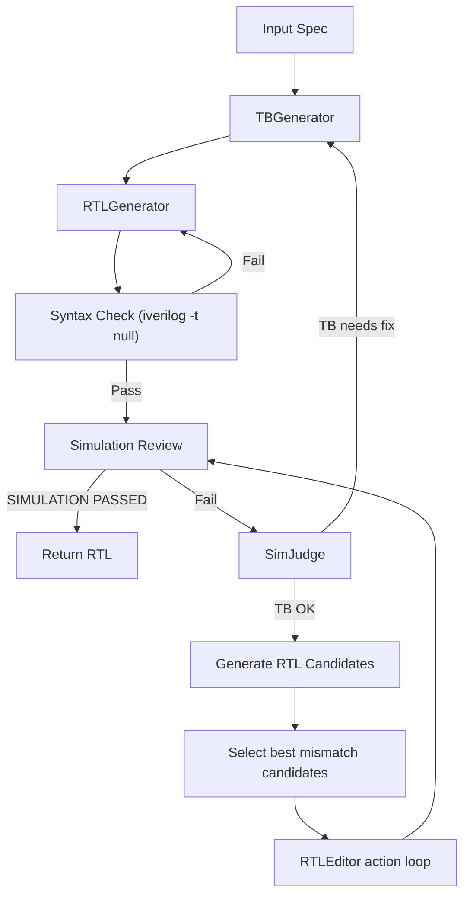

# RTL-Agent (Multi-Agent RTL Generation)

Developer and Maintainer: Dev Desai (`DevDesai-444`)

## 1) Project Overview

RTL-Agent is a Python-based multi-agent system that turns natural-language hardware specs into SystemVerilog RTL, then iteratively validates and repairs the output using generated (or benchmark-provided) testbenches and simulation feedback.

It is built around a coordinated agent pipeline:
- `TBGenerator` creates or adapts a testbench and interface.
- `RTLGenerator` generates candidate RTL with syntax-aware retries.
- `SimReviewer` compiles and simulates (`iverilog` + `vvp`) and scores mismatches.
- `SimJudge` decides whether failures are likely testbench-related.
- `RTLEditor` applies targeted RTL patch actions if mismatches persist.
- `TopAgent` orchestrates all stages, retries, logging, token/cost tracking, and artifacts.

## 2) What The System Uses, How It Uses It, and Why

| Component | What is used | How it is used | Why it is used |
|---|---|---|---|
| Runtime | Python 3.11+ | Core orchestration and tooling | Mature ecosystem and strong LLM integration support |
| LLM abstraction | `llama-index` LLM interfaces | Unified chat calls across Anthropic/OpenAI/Vertex | One codepath for multiple providers |
| Model providers | Anthropic, OpenAI, Vertex, VertexAnthropic wrapper | `mage/gen_config.py::get_llm` builds provider-specific clients | Provider/model flexibility for experimentation |
| Schema validation | `pydantic` | Typed parsing of model JSON outputs and subprocess payloads | Defensive parsing, fewer silent failures |
| Simulation/syntax | Icarus Verilog (`iverilog`) + `vvp` | Compile/syntax checks and simulation pass/fail determination | Fast feedback loop for RTL correctness |
| Coverage flow (optional) | Verilator + `verilator_coverage` + C++ helpers | Experimental coverage-guided input generation (`src/mage/converage`) | Improves test stimulus coverage exploration |
| Logging | `rich.logging` + file handlers | Structured logs to stdout and per-run files | Debuggability and reproducibility |
| Token accounting | `tiktoken`, Anthropic usage metadata, Vertex token counting | Tracks per-module token usage and estimated USD cost | Experiment budgeting and analysis |
| Config loading | `config` package + env vars | Reads `key.cfg` with env fallback | Simple credential management |
| Automation in CI | Composite GitHub Action (`action.yml`) | Installs/runs pre-commit with cache | Standardized lint/format checks in workflows |

## 3) Architecture and Execution Pipeline



### Core orchestration (`src/mage/agent.py`)

`TopAgent.run()` creates per-task output/log directories and executes `_run()` with full lifecycle control:
- Initializes `SimReviewer`, `RTLGenerator`, `TBGenerator`, `SimJudge`, `RTLEditor`.
- Generates initial TB/interface, then initial RTL.
- Runs up to `sim_max_retry=4` TB-fix cycles when simulation fails.
- If RTL still fails, generates up to `rtl_max_candidates=20` candidates and ranks by mismatch count.
- Runs editor refinement on top `rtl_selected_candidates=2` unique mismatch buckets.
- Writes `properly_finished.tag` when run completes without runtime crash.

## 4) Repository Map

```text
RTL-Agent/
  README.md
  LICENSE
  pyproject.toml
  action.yml
  testbench_generate.ipynb
  fig/                          # paper/experiment figures
  src/
    mage/
      agent.py                  # top-level orchestration
      tb_generator.py           # testbench + interface generation
      rtl_generator.py          # RTL generation + syntax retries + candidates
      rtl_editor.py             # tool-action based RTL patch loop
      sim_reviewer.py           # syntax/simulation execution and scoring
      sim_judge.py              # TB-vs-RTL fault attribution
      token_counter.py          # token/cost/accounting, cache-aware mode
      gen_config.py             # provider/key/model bootstrapping
      prompts.py                # few-shot and strict JSON output prompts
      benchmark_read_helper.py  # verilog-eval dataset loading/filtering
      bash_tools.py             # subprocess wrapper
      log_utils.py              # stdout/file logger switcher
      utils.py                  # helper funcs + VertexAnthropic credentials wrapper
      converage/                # experimental C++/Python coverage guidance (note spelling)
  src/sim/
    Makefile, Makefile_obj, top.sv, input.vc, sim_golden.vvp
  tests/
    test_top_agent.py           # main benchmark harness
    test_rtl_generator.py       # generator smoke test
    test_llm_chat.py            # provider connectivity sanity check
    test_single_agent.py        # legacy experimental script
```

## 5) Prerequisites

### Required
- Python `>=3.11`
- Icarus Verilog 12.x (`iverilog`, `vvp`) available on `PATH`

### Optional (for extended workflows)
- Verilator (coverage-guided flow in `src/mage/converage`)
- Pyverilog (used by optional coverage guidance flow)

## 6) Setup

### 6.1 Clone and install

```bash
git clone <your-repo-url>
cd RTL-Agent
python3 -m venv .venv
source .venv/bin/activate
pip install --upgrade pip
pip install .
```

Developer install:

```bash
pip install -e . --config-settings editable_mode=compat
```

### 6.2 Configure API keys

The runtime checks `key.cfg` first, then environment variables.

Create `key.cfg` in repo root (example):

```ini
OPENAI_API_KEY='...'
ANTHROPIC_API_KEY='...'
VERTEX_SERVICE_ACCOUNT_PATH='~/path/to/service-account.json'
VERTEX_REGION='us-central1'
OPENAI_API_BASE_URL=''
```

Or export equivalent env vars.

## 7) Benchmark Data (verilog-eval)

Test harnesses expect a local `verilog-eval` checkout path (configured in test args):
- V1 folder: `dataset_code-complete-iccad2023`
- V2 folder: `dataset_spec-to-rtl`

This repository currently includes an empty `verilog-eval/` directory placeholder. Populate it before benchmark runs.

## 8) Running The System

### 8.1 Main multi-agent benchmark run

Primary entry point:

```bash
python tests/test_top_agent.py
```

Control parameters are in `tests/test_top_agent.py::args_dict`:
- `provider`: `anthropic`, `openai`, `vertex`, `vertexanthropic`
- `model`: provider-specific model name
- `filter_instance`: regex to select benchmark tasks
- `type_benchmark`: `verilog_eval_v1` or `verilog_eval_v2`
- `path_benchmark`: local verilog-eval path
- `run_identifier`: names output/log dirs
- `n`: number of rounds
- `temperature`, `top_p`
- `max_token`
- `use_golden_tb_in_mage`: whether to seed TB generation from golden TB
- `key_cfg_path`: credential file path

### 8.2 Focused smoke tests

```bash
python tests/test_llm_chat.py
python tests/test_rtl_generator.py
```

## 9) Outputs and Artifacts

Per run, output is created under:
- `output_<run_identifier>/`
- `log_<run_identifier>/`

Per task directory pattern:
- `output_<run_identifier>/<BENCHMARK>_<TASK_ID>/`

Typical files:
- `tb.sv` (generated testbench)
- `if.sv` (generated module interface)
- `rtl.sv` (best RTL candidate)
- `sim_output.vvp` or `sim_golden.vvp` (sim binaries)
- `sim_review_output.json` (golden review result)
- `properly_finished.tag` (run completion marker)
- `record.json` in output root (aggregated run stats)

## 10) Module-Level Technical Details

### `src/mage/rtl_generator.py`
- Builds prompt context from spec + optional TB + optional interface + failed trial history.
- Enforces strict JSON response parsing (`reasoning`, `module`).
- Performs syntax-check retry loop (`max_trials=5`) using `check_syntax`.
- Supports candidate batch generation (`gen_candidates`) for diversity under fixed context.

### `src/mage/tb_generator.py`
- Generates testbench and interface with strict JSON output schema.
- Supports two modes:
  - Non-golden TB generation.
  - Golden TB augmentation mode (preserves golden semantics while adding diagnostics).
- Can switch mismatch reporting strategy between queue-based and moment-based displays.

### `src/mage/sim_reviewer.py`
- `check_syntax`: syntax compile gate using `iverilog -t null`.
- `sim_review`: compile+run with `iverilog` and `vvp`; pass requires `SIMULATION PASSED` marker.
- Parses mismatch count from `SIMULATION FAILED - X MISMATCHES DETECTED`.
- Filters known benign stderr lines.

### `src/mage/sim_judge.py`
- LLM-based adjudication: should TB be fixed, or proceed to RTL repair?
- Uses failed log + failed RTL + failed TB + spec as evidence.

### `src/mage/rtl_editor.py`
- Tool-action loop (currently `replace_content_by_matching`) with rollback safeguards.
- Rejects edits that increase mismatch count or break syntax.
- Keeps bounded success/failure context windows to control prompt size.

### `src/mage/token_counter.py`
- Provider-aware token counting and model cost estimation.
- Anthropic cache-aware subclass tracks cache read/write usage and equivalent costs.
- Logs per-agent and total token/cost stats.

### `src/mage/gen_config.py`
- Constructs provider-specific LLM clients.
- Supports OpenAI, Anthropic, Vertex Gemini, and VertexAnthropic bridge.
- Performs a startup health check call (`complete("Say 'Hi'")`).

### `src/mage/log_utils.py`
- Central logger factory with switchable stdout/file modes.
- Produces per-module logs and a unified run log file when file mode is enabled.

## 11) Optional Coverage-Guided Subsystem (`src/mage/converage`)

This folder contains an experimental C++/Python guidance path for Verilator coverage-driven stimulus generation.

Important notes:
- The directory name is `converage` in code (intentional as currently implemented).
- It expects external companion paths (e.g., `../llm-guidance`, `../src-basic`) not included in this repository.
- It uses pipe/file-based communication with `RunGPT.py` and OpenAI chat completions.
- Treat as an advanced extension path, not the default benchmark pipeline.

## 12) GitHub Action (Pre-Commit)

`action.yml` defines a reusable composite action that:
- installs `pre-commit`
- caches `~/.cache/pre-commit`
- runs `pre-commit run` with configurable args (`--all-files` by default)

Use this action from workflows to standardize repo checks.

## 13) Known Constraints and Practical Caveats

- Benchmark data is external and must be provided locally.
- LLM quality and determinism depend on provider/model and sampling settings.
- Strict JSON prompting reduces parser errors but cannot eliminate them; retry logic handles this.
- `tests/test_single_agent.py` is legacy/experimental and may not reflect current mainline APIs.
- Large benchmark runs may be token/cost intensive; use `filter_instance` aggressively for targeted experiments.

## 14) Troubleshooting

### `iverilog` not found
Install Icarus Verilog 12.x and verify:

```bash
iverilog -V
vvp -V
```

### Provider init fails
- Verify key path and env vars.
- Confirm model identifier exists for the selected provider.
- Check `key.cfg` formatting (no malformed quoting).

### JSON decode failures in generation
- Reduce temperature/top_p.
- Use stronger models for structured output.
- Re-run with narrower task filters.

### Simulation never reaches pass condition
- Inspect generated `tb.sv` and `rtl.sv` under per-task output directory.
- Check `sim_review_output.json` and logs for mismatch signatures.

## 15) License

This repository is under the MIT License. See `LICENSE`.
