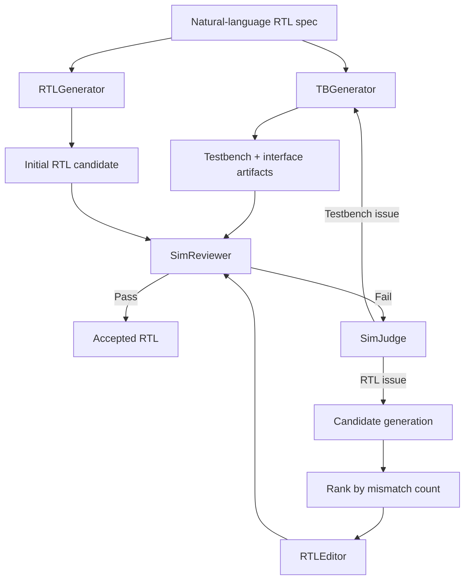
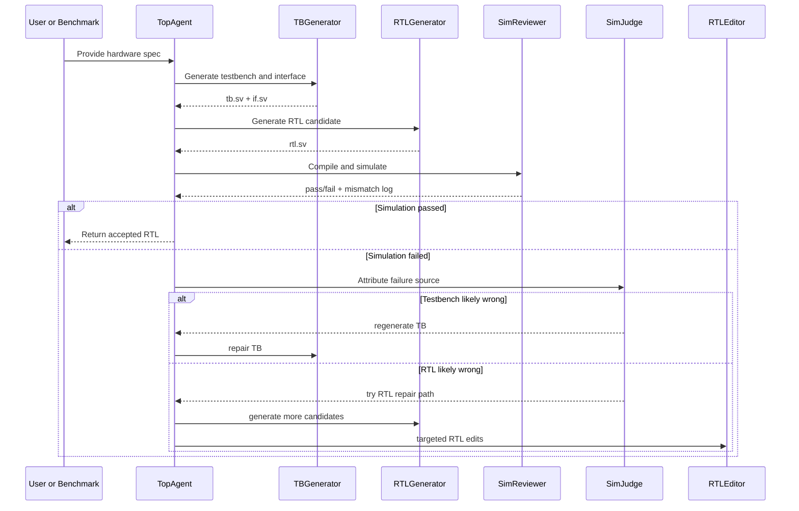

# RTL-Agent

RTL-Agent is a multi-agent LLM system for generating synthesizable SystemVerilog RTL from natural-language hardware specifications, validating the design against executable testbenches, and iteratively repairing failures using simulation feedback.

This project sits at the intersection of:
- AI agents
- hardware design automation
- benchmark-driven evaluation
- verifiable code generation

Instead of treating RTL generation as a single prompt-response task, RTL-Agent decomposes the problem into specialized roles that generate test infrastructure, draft RTL, run simulation, diagnose failures, and patch the design until it converges or exhausts a bounded repair budget.


## Why this project matters

LLMs can often produce plausible-looking RTL that is syntactically valid but behaviorally incorrect. In digital design, that gap matters more than surface fluency. A design that compiles but fails under simulation is still wrong.

RTL-Agent was built around a simple idea:

> correctness should be driven by executable feedback, not by confidence in the generated text.

That idea leads to three design choices:
- use a multi-stage agent pipeline rather than a single monolithic prompt
- treat simulation as the main source of truth
- preserve artifacts, logs, and benchmark outputs so every run is inspectable

## What RTL-Agent does

Given a benchmark problem or a free-form RTL task, RTL-Agent can:
- read a natural-language specification
- derive or adapt a testbench and interface
- generate candidate RTL implementations
- run syntax and simulation checks with Icarus Verilog
- identify likely failure modes
- decide whether the issue is in the testbench or in the RTL
- patch the RTL iteratively using targeted edits
- record token usage, cost estimates, runtime, and per-task artifacts

## System architecture

RTL-Agent is organized as a coordinator plus a set of specialized worker agents.



### Core components

| Component | Responsibility | Why it exists |
|---|---|---|
| `TopAgent` | Orchestrates the full lifecycle of a run | Keeps the workflow deterministic and bounded |
| `TBGenerator` | Produces a testbench and interface scaffold | Gives the RTL generator executable context |
| `RTLGenerator` | Generates the initial RTL and additional candidates | Explores multiple implementations under the same spec |
| `SimReviewer` | Compiles and simulates the design | Converts textual generation into a hard pass/fail signal |
| `SimJudge` | Decides whether failure likely comes from TB or RTL | Prevents wasted repair loops on the wrong artifact |
| `RTLEditor` | Applies focused corrective edits to RTL | Adds a repair phase instead of restarting from scratch |
| `TokenCounter` | Tracks token usage and estimated provider cost | Makes experimentation measurable and budget-aware |

## End-to-end execution flow

At a high level, an RTL-Agent run follows this lifecycle:



### Design intent behind the workflow

This pipeline is intentionally conservative:
- syntax is checked before deeper repair work
- simulation output is treated as the governing signal
- retries are bounded to avoid unproductive loops
- candidate generation and editing are both available, because some failures need exploration while others need local patching

## Repository structure

```text
RTL-Agent/
  README.md
  LICENSE
  pyproject.toml
  action.yml
  fig/
  src/
    mage/
      agent.py
      benchmark_read_helper.py
      bash_tools.py
      gen_config.py
      log_utils.py
      prompts.py
      rtl_editor.py
      rtl_generator.py
      sim_judge.py
      sim_reviewer.py
      tb_generator.py
      token_counter.py
      utils.py
    sim/
      Makefile
      Makefile_obj
      top.sv
      input.vc
      sim_golden.vvp
  tests/
    test_llm_chat.py
    test_rtl_generator.py
    test_single_agent.py
    test_top_agent.py
  verilog-eval/
```

## Technical deep dive

### 1. `TopAgent`: the orchestrator

[`src/mage/agent.py`](/Users/DEVDESAI1/Desktop/University_at_Buffalo/Projects/RTL-Agent/src/mage/agent.py) owns the high-level control flow. It:
- creates per-run output and log directories
- initializes all worker modules
- executes either the full multi-agent flow or an ablation path
- enforces retry budgets such as `sim_max_retry`, `rtl_max_candidates`, and `rtl_selected_candidates`
- persists task-level artifacts like `tb.sv`, `if.sv`, `rtl.sv`, and `properly_finished.tag`

The main architectural value of `TopAgent` is that it turns several individually useful modules into a repeatable experimental system.

### 2. `TBGenerator`: executable context generation

[`src/mage/tb_generator.py`](/Users/DEVDESAI1/Desktop/University_at_Buffalo/Projects/RTL-Agent/src/mage/tb_generator.py) generates:
- a SystemVerilog testbench
- the interface or module signature

This matters because LLM-generated RTL quality improves when the model sees the shape of expected interaction, not just a prose description.

### 3. `RTLGenerator`: syntax-aware implementation search

[`src/mage/rtl_generator.py`](/Users/DEVDESAI1/Desktop/University_at_Buffalo/Projects/RTL-Agent/src/mage/rtl_generator.py) handles:
- initial RTL generation
- syntax retry loops
- candidate batch generation for later ranking
- an ablation mode that isolates single-pass RTL generation

This lets the project measure two regimes:
- full multi-agent repair
- reduced single-pass generation for comparison

### 4. `SimReviewer`: hard correctness signal

[`src/mage/sim_reviewer.py`](/Users/DEVDESAI1/Desktop/University_at_Buffalo/Projects/RTL-Agent/src/mage/sim_reviewer.py) is the verification core. It:
- runs syntax checks with `iverilog -t null`
- compiles executable simulation payloads
- runs the design under simulation
- parses failure patterns and mismatch counts

This is the module that converts speculative generation into measurable behavior.

### 5. `SimJudge`: fault attribution

[`src/mage/sim_judge.py`](/Users/DEVDESAI1/Desktop/University_at_Buffalo/Projects/RTL-Agent/src/mage/sim_judge.py) uses model reasoning to answer a crucial systems question:

Is the current failure more likely due to a flawed testbench or flawed RTL?

That distinction improves repair efficiency because otherwise the pipeline can spend compute patching the wrong artifact.

### 6. `RTLEditor`: targeted recovery instead of restart

[`src/mage/rtl_editor.py`](/Users/DEVDESAI1/Desktop/University_at_Buffalo/Projects/RTL-Agent/src/mage/rtl_editor.py) applies constrained edit actions to a failing RTL candidate. This module is important because many generated designs are close to correct. In those cases, local repair is often cheaper and more stable than full regeneration.

### 7. `TokenCounter`: experimental observability

[`src/mage/token_counter.py`](/Users/DEVDESAI1/Desktop/University_at_Buffalo/Projects/RTL-Agent/src/mage/token_counter.py) tracks:
- input token count
- output token count
- provider-specific cost heuristics
- cache-aware token accounting where available

This makes the system useful not just as a prototype, but as an experimental platform where performance can be discussed alongside inference cost.

## Model and provider support

RTL-Agent uses `llama-index` abstractions to normalize calls across multiple LLM backends. The current codebase supports:
- Anthropic
- OpenAI
- Vertex AI
- Vertex Anthropic bridge
- Groq via OpenAI-compatible API
- Cerebras via OpenAI-compatible API

Provider setup is handled in [`src/mage/gen_config.py`](/Users/DEVDESAI1/Desktop/University_at_Buffalo/Projects/RTL-Agent/src/mage/gen_config.py).

This flexibility matters for benchmarking because the project is not tied to a single inference vendor or model family.

## Benchmarks

RTL-Agent is designed around the `verilog-eval` benchmark suite included in this repository under [verilog-eval](/Users/DEVDESAI1/Desktop/University_at_Buffalo/Projects/RTL-Agent/verilog-eval).

The benchmark helper in [`src/mage/benchmark_read_helper.py`](/Users/DEVDESAI1/Desktop/University_at_Buffalo/Projects/RTL-Agent/src/mage/benchmark_read_helper.py) supports:
- `verilog_eval_v1`
- `verilog_eval_v2`

### Dataset organization

| Benchmark mode | Dataset folder | Purpose |
|---|---|---|
| `verilog_eval_v1` | `dataset_code-complete-iccad2023` | code-completion style RTL tasks |
| `verilog_eval_v2` | `dataset_spec-to-rtl` | specification-to-RTL generation tasks |

### Benchmark runner

The main benchmark harness lives in [`tests/test_top_agent.py`](/Users/DEVDESAI1/Desktop/University_at_Buffalo/Projects/RTL-Agent/tests/test_top_agent.py).

It currently includes a Cerebras/Qwen ablation configuration for:
- provider: `cerebras`
- model: `qwen-3-235b-a22b-instruct-2507`
- benchmark: `verilog_eval_v2`
- task selection: full 156-task sweep
- ablation mode: enabled
- golden testbench injection: disabled

## Results snapshot

This repository currently contains one directly inspectable benchmark artifact:

- run: `output_verilog_eval_v2_cerebras_qwen3_ablation_0`
- benchmark: VerilogEval-Human v2
- tasks evaluated: `156`
- recorded passes: `0`
- total runtime: `1:23:14.384274`
- token limit consumption: `482431`

Source artifact:
- [output_verilog_eval_v2_cerebras_qwen3_ablation_0/record.json](/Users/DEVDESAI1/Desktop/University_at_Buffalo/Projects/RTL-Agent/output_verilog_eval_v2_cerebras_qwen3_ablation_0/record.json)

### How to interpret that result

This is not presented as a success benchmark. It is a baseline artifact.

The current ablation configuration intentionally disables most of the system behavior that makes RTL-Agent interesting:
- no golden testbench injection
- no iterative multi-agent repair loop
- no candidate ranking and editor-based recovery inside the ablation path

So the `0/156` outcome should be read as:
- a useful lower bound for single-pass spec-to-RTL generation in this configuration
- evidence that raw generation alone is insufficient
- motivation for the full multi-agent repair architecture

## Research hypotheses

The project is built around the following hypotheses:

### Hypothesis 1

Multi-agent decomposition should outperform single-pass RTL generation on behavioral correctness.

Rationale:
- testbench generation and repair require different reasoning than RTL synthesis
- simulation feedback is more useful when different agents specialize in interpreting it

### Hypothesis 2

Candidate generation plus mismatch-based ranking should recover from more failures than naive regeneration.

Rationale:
- multiple syntactically valid candidates expose behavioral diversity
- mismatch count provides a pragmatic ranking signal even before perfect correctness

### Hypothesis 3

Targeted RTL editing should improve efficiency over restarting the entire generation process.

Rationale:
- many failures are local rather than architectural
- patching is cheaper than full re-synthesis when the design is close

### Hypothesis 4

Executable verification artifacts are necessary for credible LLM-for-hardware systems.

Rationale:
- human-readable RTL can still be semantically wrong
- compile and simulation steps create an objective acceptance criterion

## Experimental methodology

A typical evaluation loop for this project is:

1. Select a benchmark subset or full benchmark split.
2. Fix provider, model, temperature, and token budget.
3. Run either ablation mode or the full multi-agent flow.
4. Save all task-level outputs and logs.
5. Measure pass rate, runtime, token usage, and cost.
6. Inspect hard failures to determine whether the bottleneck is generation, verification, or repair policy.

## Artifact layout

Each benchmark run produces two main folders:
- `output_<run_identifier>/`
- `log_<run_identifier>/`

For each task, you will typically see:
- `tb.sv`
- `if.sv`
- `rtl.sv`
- `sim_review_output.json`
- `properly_finished.tag`

This structure makes the system useful for postmortem analysis, not just one-shot execution.

## Tooling stack

| Layer | Tools |
|---|---|
| Language runtime | Python 3.11+ |
| LLM abstraction | `llama-index` |
| Model providers | Anthropic, OpenAI, Vertex, Groq, Cerebras |
| Verification | Icarus Verilog (`iverilog`, `vvp`) |
| Packaging | `setuptools`, `pyproject.toml` |
| Validation and typing | `pydantic` |
| Token accounting | `tiktoken` and provider metadata |
| Automation | `pre-commit`, GitHub composite action |

## Setup

### Requirements

- Python `>= 3.11`
- `iverilog`
- `vvp`

Optional:
- Verilator for the experimental coverage-guided flow

### Install

```bash
git clone <repo-url>
cd RTL-Agent
python3 -m venv .venv
source .venv/bin/activate
pip install --upgrade pip
pip install -e .
```

### API credentials

The runtime reads `key.cfg` first, then falls back to environment variables.

Example:

```ini
OPENAI_API_KEY='...'
ANTHROPIC_API_KEY='...'
GROQ_API_KEY='...'
CEREBRAS_API_KEY='...'
VERTEX_SERVICE_ACCOUNT_PATH='~/path/to/service-account.json'
VERTEX_REGION='us-central1'
```

## Usage

### Main benchmark execution

```bash
python tests/test_top_agent.py
```

### Focused checks

```bash
python tests/test_llm_chat.py
python tests/test_rtl_generator.py
```

## Engineering decisions worth calling out

### 1. The project optimizes for inspectability

The repository preserves logs, outputs, and benchmark interfaces so runs can be audited after the fact.

### 2. Verification is built into the generation loop

This is not a plain text-generation demo. The core loop is grounded in compiler and simulator feedback.

### 3. The system is benchmark-oriented

The codebase is structured so new models and providers can be tested against the same task corpus.

### 4. The architecture is intentionally modular

Each sub-agent can be replaced, extended, or ablated independently, which makes the project suitable for experimentation and future research.

## Current limitations

- The included ablation result is a baseline, not a polished SOTA claim.
- Token cost tables are incomplete for some newly added providers and models.
- The benchmark harness is currently script-driven rather than packaged as a CLI.
- The `converage` directory is experimental and depends on additional external setup.
- Some provider integrations are newer than others and need broader evaluation coverage.

## Next steps

Planned or natural next directions for this project include:
- running the full non-ablation multi-agent pipeline on VerilogEval-Human v2
- comparing pass rate across Anthropic, OpenAI-compatible, and Vertex backends
- measuring repair-stage contribution versus single-pass generation
- adding structured experiment configs instead of editing Python dictionaries
- expanding cost accounting for newer OpenAI-compatible inference providers
- generating publication-quality benchmark summary tables directly from `record.json`

## Summary

RTL-Agent is not just an LLM wrapper for hardware code generation. It is a verification-aware, multi-agent experimental system for turning natural-language design intent into executable RTL artifacts and then stress-testing those artifacts against benchmark-driven simulation loops.

The strongest part of the project is the architecture:
- decomposition into specialized agents
- simulation-grounded feedback
- bounded repair loops
- benchmark instrumentation and artifact retention

The current included benchmark snapshot is intentionally candid. It shows where raw ablation performance stands today and why the full repair-oriented architecture is the right direction.
